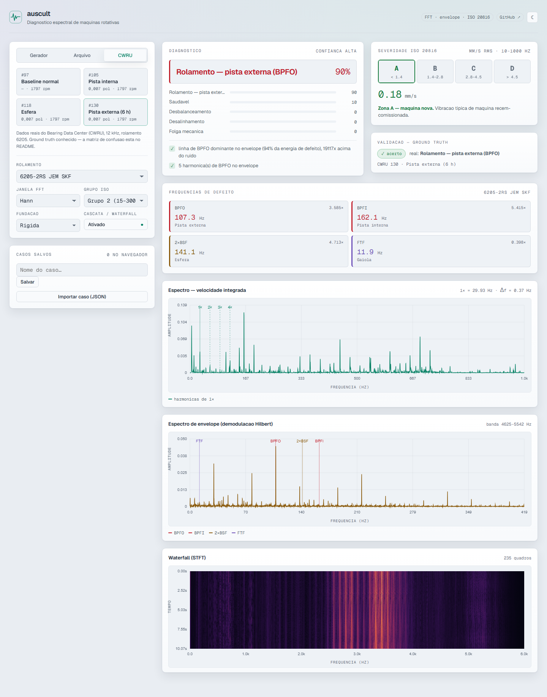
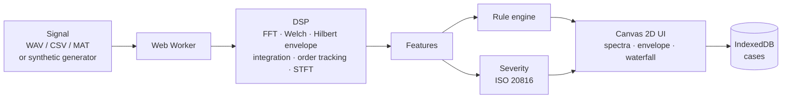

# Auscult — Rotating-machine vibration diagnostics in the browser

[Português](README.md) · **English**

[](https://github.com/igorjba/auscult/actions/workflows/ci.yml)


Detects the likely fault of a rotating machine from its vibration signal, straight in the browser.

<picture>
  <source media="(prefers-color-scheme: dark)" srcset="docs/screenshot-dark.png">
  <source media="(prefers-color-scheme: light)" srcset="docs/screenshot-light.png">
  
</picture>

<p align="center"><em>Outer-race fault diagnosis (BPFO) over real CWRU record #130: the BPFO dominates the envelope spectrum with its harmonic series, and the result matches the published ground truth.</em></p>

<p align="center"><a href="#guarantees">Guarantees</a> · <a href="#running-locally">Running</a> · <a href="#architecture">Architecture</a></p>

## Overview

Rotating machines — motors, pumps, fans — vibrate, and the pattern of that vibration betrays a failing bearing long before the machine stops. Auscult reads a vibration signal and names the likely fault (unbalance, misalignment, looseness, bearing fault, cavitation, oil whirl), with an ISO severity grade and the evidence behind each hypothesis. All processing happens in the browser itself: the signal never leaves the user's machine or reaches a server.

Under the interface sits a signal-processing chain written from scratch in TypeScript: windowed FFT, Welch PSD, envelope analysis via the Hilbert transform, order tracking for variable speed, and bearing defect frequencies derived from geometry. The diagnosis is not a trained model but an engine of explicit physical rules — each rule is readable, scores a hypothesis, and shows why it got there. Accepted inputs are synthetic signals with injected faults, user-uploaded WAV/CSV/MAT files, and the real records from the Case Western Reserve University bearing dataset.

Deterministic DSP is testable, and fault detection is falsifiable when ground truth exists. That is why this document opens with the guarantees: each is a property a command proves, not a claim to be believed.

## Guarantees

Each invariant is checked by a command. The test files in parentheses are run by `npm test`.

| Guarantee | Proof |
| --- | --- |
| The FFT preserves energy (Parseval) and round-trips through the inverse, including non-power-of-two lengths (Bluestein) | `npm test` — `dsp.test.ts` |
| Window corrections recover unit amplitude; flat-top reads the true peak of a tone | `npm test` — `dsp.test.ts` |
| The Hilbert transform is in quadrature (Hilbert of `sin` = `-cos`) and recovers the envelope of a modulated carrier | `npm test` — `dsp.test.ts` |
| Acceleration→velocity integration scales by 1/ω and rejects drift below the corner | `npm test` — `dsp.test.ts` |
| The 6205 bearing geometry reproduces the CWRU-published factors (BPFO 3.585×, BPFI 5.415×, FTF 0.398×, BSF 2.357×), and the identity BPFO+BPFI = Nb·fr holds across the whole catalogue | `npm test` — `bearings.test.ts` |
| Order tracking recovers a fixed order from a variable-speed record that would otherwise smear across many bins | `npm test` — `orderTracking.test.ts` |
| Parsers and case import are hardened: they reject malformed WAV, clamp the declared length to the real buffer (no out-of-bounds read), cap size (DoS guard), and never carry prototype-polluting keys through | `npm test` — `security.test.ts` |
| Classification of the synthetic set (72 cases, 9 classes) reaches 100% accuracy | `npm run validate` |
| On the real CWRU data, the healthy, inner-race and outer-race cases are identified correctly | `npm run validate:cwru` |

## What it does

- **DSP** — radix-2 FFT with a Bluestein fallback for arbitrary lengths; Hann, Hamming, Blackman-Harris and flat-top windows with amplitude- and energy-gain correction; Welch PSD; Hilbert transform and analytic signal; acceleration→velocity integration in the frequency domain.
- **Envelope analysis** — resonance band selected by spectral kurtosis, linear band-pass, Hilbert demodulation and envelope spectrum. This is what reveals an incipient bearing fault, whose signature lies in the *rhythm* of the impacts, not in the resonance they excite.
- **Defect frequencies** — BPFO, BPFI, BSF and FTF derived from bearing geometry (element count, diameters, contact angle), with slip. SKF bearing catalogue (6000/6200/6300 series, cylindrical and spherical rollers) and custom geometry entry for any bearing outside the catalogue.
- **Order tracking** — angular resampling for variable-speed machines, with shaft phase from a tachometer or estimated (tacho-less) via the instantaneous phase of the 1×.
- **Diagnosis engine** — explicit, auditable rules (unbalance, misalignment, looseness, outer/inner-race/ball, cavitation, oil whirl), each hypothesis accompanied by the evidence that supports it.
- **Severity** — band velocity RMS (10–1000 Hz) graded into ISO 10816-3 / 20816-3 zones A/B/C/D.
- **Waterfall** — STFT spectrogram with a colour map to follow the spectral evolution across the record.
- **Cases** — local persistence in IndexedDB, with JSON export/import of cases. No account, no server.

## How the diagnosis decides

The rules are physical and readable, scored by ratios (scale-invariant) for shape and by absolute amplitude for level:

| Signature                                                | Diagnosis      |
| -------------------------------------------------------- | -------------- |
| large, dominant 1×, stable phase, few harmonics          | Unbalance      |
| 2× comparable to or above 1× + harmonic series           | Misalignment   |
| long series of 1× harmonics + half-order                 | Mechanical looseness |
| dominant BPFO line in the envelope + harmonics           | Outer race     |
| dominant BPFI + 1× sidebands                             | Inner race     |
| dominant 2×BSF + cage sidebands                          | Ball           |
| flat broadband 500 Hz–5 kHz, no discrete line            | Cavitation     |
| prominent subsynchronous line at 0.42–0.48×              | Oil whirl      |

Key discriminators: the **kurtosis of the resonance band** separates impulsive phenomena (bearing) from non-impulsive; the **prominence and relative dominance** of the defect line in the envelope separate a real fault from a noise peak and name the faulty element; the **absolute amplitude** separates a healthy machine from a fault.

## Validation

Two fronts, both automated in `npm test` and reproducible with the validation scripts.

### Synthetic signals (perfect ground truth)

Generator with injected fault physics (impact train exciting a damped resonance, load-zone modulation, slip, Gaussian noise). 72 cases — 8 per class — spanning 1200–3560 rpm, varied severities and noise levels. `npm run validate` prints the confusion matrix:

```text
truth\pred     HLT   UNB   MIS   LOO  BPFO  BPFI   BSF   CAV  WHRL
HLT              8     .     .     .     .     .     .     .     .
UNB              .     8     .     .     .     .     .     .     .
MIS              .     .     8     .     .     .     .     .     .
LOO              .     .     .     8     .     .     .     .     .
BPFO             .     .     .     .     8     .     .     .     .
BPFI             .     .     .     .     .     8     .     .     .
BSF              .     .     .     .     .     .     8     .     .
CAV              .     .     .     .     .     .     .     8     .
WHRL             .     .     .     .     .     .     .     .     8

Acuracia: 100,0%  (n=72)
```

### Real data — Case Western Reserve University

Four 12 kHz drive-end records (6205 bearing, ~1797 rpm) with known fault and size. The envelope detector runs against the university's published truth (`npm run validate:cwru`):

| File | Real fault          | Size      | Diagnosis  |     |
| ---- | ------------------- | --------- | ---------- | --- |
| 97   | Healthy (baseline)  | —         | Healthy    | ✓   |
| 105  | Inner race          | 0.007 in  | Inner race | ✓   |
| 130  | Outer race          | 0.007 in  | Outer race | ✓   |
| 118  | Ball                | 0.007 in  | Outer race | ✗   |

3 of 4. The ball fault is the dataset's acknowledged hard case — its energy spreads and the 2×BSF line rarely dominates the envelope; the literature reports the lowest hit rate in this class. The detector at least flags it as a bearing fault rather than a healthy machine.

## Running locally

```bash
npm install
npm run dev            # http://localhost:3000
```

```bash
npm test               # DSP, bearing geometry, hardening, synthetic validation and CWRU
npm run validate       # prints the synthetic confusion matrix
npm run validate:cwru  # runs the detector against the CWRU files
npm run bench          # measures the analysis-chain latency
npm run build          # production build
```

## Architecture

The signal enters through a parser (WAV/CSV/MAT) or the synthetic generator, runs through the DSP chain inside a Web Worker so the UI never stalls, and comes out as features that feed the rule engine and the severity classifier in parallel. None of it touches the network.



Structural decisions:

- **DSP in a Web Worker.** The signal chain runs off the main thread; the UI stays responsive even on long records. The worker exposes a narrow interface, and the same DSP code feeds the validation suite without going through the browser.
- **Canvas 2D** for spectra, envelope and waterfall, drawn directly from the output arrays.
- **IndexedDB** stores cases locally; **fflate** unzips the MAT-files. There is no other runtime dependency.
- **Strictly local processing.** `next.config.ts` pins a `default-src 'self'` CSP, denies `object-src`/`frame-ancestors` and forbids `eval` in production; no third-party code is loaded and the only network used is the fetch of the app's own static data.

### Stack

- **Next.js 16** (App Router, Turbopack) + **React 19** + **TypeScript**
- Pure-TypeScript DSP: FFT, Hilbert, PSD and integration implemented from scratch, no numerical library
- **Vitest** for the tests; **fflate** as the only runtime dependency

### Structure

```text
src/
  core/
    dsp/          FFT, windows, spectrum/PSD, Hilbert, envelope, integration, order tracking, STFT
    bearings.ts   geometry -> defect frequencies + catalogue
    signal/       fault generator, WAV/CSV/MAT parsers
    diagnosis/    feature extraction, rule engine, ISO severity
    validation/   synthetic suite + CWRU cases
    analyze.ts    end-to-end pipeline
  lib/            DSP worker, IndexedDB storage, input hardening
  app/            Next.js UI (instrument components)
public/data/cwru/ CWRU records (97, 105, 118, 130)
```

## Alternatives considered

| Decision | Rejected alternative | Reason |
| --- | --- | --- |
| DSP implemented from scratch | Numerical library (fft.js, dsp.js) | Full control over windowing and corrections, and coverage by invariant tests (Parseval, Hilbert quadrature). Keeps a single runtime dependency and a lean worker payload. |
| Explicit physical rule engine | Trained classifier (ML) | Every diagnosis must show the physical evidence that supports it and be auditable. A trained model would need a large labelled dataset and deliver a black box; the rules are falsifiable against ground truth. |
| All processing on the client | Processing backend | A vibration signal can be sensitive. Keeping everything in the browser removes data exposure and server infrastructure. Cost: record size is bounded by browser memory. |
| Local persistence in IndexedDB | Account and server-side database | No account and no user data under custody. Cases are exportable as JSON for portability across browsers. |

## Benchmarks

CPU cost of the full chain (`analyze`: FFT + Welch + Hilbert envelope + integration + rules + ISO severity) over synthetic bearing records at 12 kHz. Median of 40 runs after 8 warmup, in a single Node/V8 process — excludes the Web Worker transfer and canvas rendering.

| Record | Samples | Median  |
| ------ | ------- | ------- |
| 1 s    | 12,000  | ~57 ms  |
| 5 s    | 60,000  | ~276 ms |
| 10 s   | 120,000 | ~545 ms |
| 20 s   | 240,000 | ~1.2 s  |

Hardware: Intel Core i7-6700 @ 3.40 GHz, Node 24. Reproducible with `npm run bench`.

## Tests

`npm test` runs five layers, each proving a class of property:

- **DSP** (`dsp.test.ts`) — numerical invariants: Parseval, FFT round-trip, Hilbert quadrature, window corrections, integration and kurtosis.
- **Bearing geometry** (`bearings.test.ts`) — the derived orders match the CWRU-published factors and are self-consistent across the whole catalogue, including custom geometry.
- **Order tracking** (`orderTracking.test.ts`) — angular resampling recovers the order of a variable-speed record and estimates shaft phase tacho-less.
- **Input hardening** (`security.test.ts`) — WAV parsing and case import withstand malformed, hostile and oversized input.
- **Diagnosis validation** (`suite.test.ts`, `cwru.test.ts`) — the end-to-end pipeline against the synthetic set and the real CWRU records.

## Limitations

- The ball fault (BSF) is the weak case: 3 of 4 on CWRU. Its energy spreads and the 2×BSF line rarely dominates the envelope, so the element may be named as outer race — though the record is still flagged as a bearing fault.
- Real-data validation covers bearings only (CWRU dataset). The machine rules — unbalance, misalignment, looseness, cavitation, oil whirl — are validated against synthetic signals only.
- Single-channel analysis: without phase between measurement points, misalignment and looseness are inferred from a single point's spectrum, not from simultaneous measurements.
- Nominal speed (rpm) is supplied by the user; order tracking can estimate shaft phase tacho-less, but the base speed starts from the supplied value.
- All processing runs on the client, so record size is bounded by browser memory.

## License

All rights reserved. The source is public for reference and evaluation only; no use, copying or redistribution is permitted without written consent. See [LICENSE](LICENSE).

Author: Igor Bahia · [github.com/igorjba](https://github.com/igorjba)

## References

- ISO 20816-3 / ISO 10816-3 — evaluation of machine vibration by measurements on non-rotating parts.
- Case Western Reserve University Bearing Data Center — faulty-bearing dataset.
- Randall, R. B.; Antoni, J. *Rolling element bearing diagnostics — a tutorial* (2011).
- McFadden, P. D.; Smith, J. D. *Model for the vibration produced by a single point defect in a rolling element bearing* (1984).
