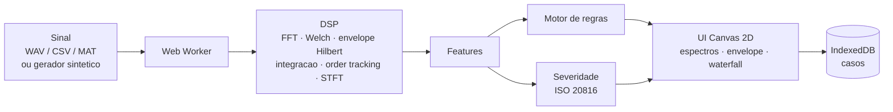

# Auscult — Diagnóstico de vibração de máquinas rotativas no navegador

**Português** · [English](README.en.md)

[](https://github.com/igorjba/auscult/actions/workflows/ci.yml)


Detecta o defeito provável de uma máquina rotativa a partir do sinal de vibração, direto no navegador.

<picture>
  <source media="(prefers-color-scheme: dark)" srcset="docs/screenshot-dark.png">
  <source media="(prefers-color-scheme: light)" srcset="docs/screenshot-light.png">
  
</picture>

<p align="center"><em>Diagnóstico de defeito de pista externa (BPFO) sobre o registro real #130 do CWRU: o BPFO domina o espectro de envelope com sua série harmônica, e o resultado bate com o ground truth publicado.</em></p>

<p align="center"><a href="#garantias">Garantias</a> · <a href="#rodando-localmente">Como rodar</a> · <a href="#arquitetura">Arquitetura</a></p>

## Visão geral

Máquinas rotativas — motores, bombas, ventiladores — vibram, e o padrão dessa vibração denuncia um rolamento em falha muito antes de a máquina parar. Auscult lê um sinal de vibração e aponta o defeito provável (desbalanceamento, desalinhamento, folga, falha de rolamento, cavitação, whirl de óleo), com uma classificação de gravidade por norma ISO e a evidência que sustenta cada hipótese. Todo o processamento acontece no próprio navegador: o sinal nunca sai da máquina do usuário nem chega a um servidor.

Sob a interface há uma cadeia de processamento de sinais escrita do zero em TypeScript: FFT com janelamento, PSD por Welch, análise de envelope por transformada de Hilbert, order tracking para rotação variável, e o cálculo das frequências de defeito de rolamento a partir da geometria. O diagnóstico não é um modelo treinado, e sim um motor de regras físicas explícitas — cada regra é legível, pontua uma hipótese e mostra por que chegou nela. As entradas aceitas são sinais sintéticos com falha injetada, arquivos WAV/CSV/MAT enviados pelo usuário e os registros reais do dataset de rolamentos da Case Western Reserve University.

DSP determinístico é testável e detecção de falha é falsificável quando há ground truth. Por isso este documento abre pelas garantias: cada uma é uma propriedade que um comando prova, não uma afirmação a acreditar.

## Garantias

Cada invariante é verificada por um comando. Os arquivos de teste entre parênteses são executados por `npm test`.

| Garantia | Prova |
| --- | --- |
| A FFT preserva energia (Parseval) e volta pela inversa, inclusive em comprimentos que não são potência de 2 (Bluestein) | `npm test` — `dsp.test.ts` |
| As correções de janela recuperam amplitude unitária; a flat-top lê o pico verdadeiro de um tom | `npm test` — `dsp.test.ts` |
| A transformada de Hilbert está em quadratura (Hilbert de `sin` = `-cos`) e recupera o envelope de uma portadora modulada | `npm test` — `dsp.test.ts` |
| A integração aceleração→velocidade escala por 1/ω e rejeita deriva abaixo do corte | `npm test` — `dsp.test.ts` |
| A geometria do rolamento 6205 reproduz os fatores publicados pelo CWRU (BPFO 3,585×, BPFI 5,415×, FTF 0,398×, BSF 2,357×), e a identidade BPFO+BPFI = Nb·fr vale para todo o catálogo | `npm test` — `bearings.test.ts` |
| O order tracking recupera uma ordem fixa de um registro com rotação variável que, sem reamostragem, se espalharia por vários bins | `npm test` — `orderTracking.test.ts` |
| Os parsers e a importação de casos são endurecidos: rejeitam WAV malformado, limitam o comprimento declarado ao buffer real (sem leitura fora dos limites), impõem teto de tamanho (guarda de DoS) e não propagam chaves de prototype pollution | `npm test` — `security.test.ts` |
| A classificação do conjunto sintético (72 casos, 9 classes) atinge 100% de acurácia | `npm run validate` |
| Nos dados reais do CWRU, os casos saudável, pista interna e pista externa são identificados corretamente | `npm run validate:cwru` |

## O que faz

- **DSP** — FFT radix-2 com fallback de Bluestein para comprimentos arbitrários; janelas Hann, Hamming, Blackman-Harris e flat-top com correção de ganho de amplitude e de energia; PSD por Welch; transformada de Hilbert e sinal analítico; integração aceleração→velocidade no domínio da frequência.
- **Análise de envelope** — banda de ressonância selecionada por curtose espectral, band-pass linear, demodulação Hilbert e espectro de envelope. É o que revela falha incipiente de rolamento, cuja assinatura está no *ritmo* dos impactos, não na ressonância que eles excitam.
- **Frequências de defeito** — BPFO, BPFI, BSF e FTF derivadas da geometria do rolamento (número de elementos, diâmetros, ângulo de contato), com escorregamento. Catálogo de rolamentos SKF (séries 6000/6200/6300, rolos cilíndricos e esféricos) e entrada de geometria personalizada para qualquer rolamento fora do catálogo.
- **Order tracking** — reamostragem angular para máquinas de rotação variável, com fase do eixo por tacômetro ou estimada (tacho-less) via fase instantânea do 1×.
- **Motor de diagnóstico** — regras explícitas e auditáveis (desbalanceamento, desalinhamento, folga, pista externa/interna/esfera, cavitação, whirl de óleo), cada hipótese acompanhada das evidências que a sustentam.
- **Severidade** — RMS de velocidade em banda (10–1000 Hz) classificado nas zonas A/B/C/D da ISO 10816-3 / 20816-3.
- **Waterfall** — espectrograma STFT com mapa de cores para acompanhar a evolução espectral ao longo do registro.
- **Casos** — persistência local em IndexedDB, com exportação/importação de casos em JSON. Sem conta, sem servidor.

## Como o diagnóstico decide

As regras são físicas e legíveis, pontuadas por razões (invariantes à escala) para a forma e por amplitude absoluta para o nível:

| Assinatura                                             | Diagnóstico      |
| ------------------------------------------------------ | ---------------- |
| 1× grande e dominante, fase estável, poucas harmônicas | Desbalanceamento |
| 2× comparável ou acima de 1× + série harmônica         | Desalinhamento   |
| série longa de harmônicas de 1× + meia-ordem           | Folga mecânica   |
| linha de BPFO dominante no envelope + harmônicas       | Pista externa    |
| BPFI dominante + bandas laterais de 1×                 | Pista interna    |
| 2×BSF dominante + bandas laterais da gaiola            | Esfera           |
| banda larga plana em 500 Hz–5 kHz, sem linha discreta  | Cavitação        |
| linha subsíncrona proeminente em 0,42–0,48×            | Whirl de óleo    |

Discriminadores-chave: a **curtose da banda de ressonância** separa fenômeno impulsivo (rolamento) de não-impulsivo; a **prominência e a dominância relativa** da linha de defeito no envelope separam falha real de pico de ruído e nomeiam o elemento defeituoso; a **amplitude absoluta** separa máquina saudável de falha.

## Validação

Duas frentes, ambas automatizadas em `npm test` e reproduzíveis pelos scripts de validação.

### Sinais sintéticos (ground truth perfeito)

Gerador com física de falha injetada (trem de impactos excitando ressonância amortecida, modulação pela zona de carga, escorregamento, ruído gaussiano). 72 casos — 8 por classe — cobrindo 1200–3560 rpm, severidades e níveis de ruído variados. `npm run validate` imprime a matriz de confusão:

```text
truth\pred     HLT   UNB   MIS   LOO  BPFO  BPFI   BSF   CAV  WHRL
HLT              8     .     .     .     .     .     .     .     .
UNB              .     8     .     .     .     .     .     .     .
MIS              .     .     8     .     .     .     .     .     .
LOO              .     .     .     8     .     .     .     .     .
BPFO             .     .     .     .     8     .     .     .     .
BPFI             .     .     .     .     .     8     .     .     .
BSF              .     .     .     .     .     .     8     .     .
CAV              .     .     .     .     .     .     .     8     .
WHRL             .     .     .     .     .     .     .     .     8

Acuracia: 100,0%  (n=72)
```

### Dados reais — Case Western Reserve University

Quatro registros de 12 kHz do mancal motriz (rolamento 6205, ~1797 rpm), com falha e tamanho conhecidos. O detector de envelope é rodado contra a verdade publicada pela universidade (`npm run validate:cwru`):

| Arquivo | Falha real          | Tamanho   | Diagnóstico   |     |
| ------- | ------------------- | --------- | ------------- | --- |
| 97      | Saudável (baseline) | —         | Saudável      | ✓   |
| 105     | Pista interna       | 0,007 pol | Pista interna | ✓   |
| 130     | Pista externa       | 0,007 pol | Pista externa | ✓   |
| 118     | Esfera              | 0,007 pol | Pista externa | ✗   |

3 de 4. O defeito de esfera é o caso reconhecidamente difícil do dataset — sua energia se espalha e a linha 2×BSF raramente domina o envelope; a literatura reporta a menor taxa de acerto nessa classe. O detector ao menos o sinaliza como falha de rolamento, e não como máquina saudável.

## Rodando localmente

```bash
npm install
npm run dev            # http://localhost:3000
```

```bash
npm test               # DSP, geometria de rolamento, hardening, validacao sintetica e CWRU
npm run validate       # imprime a matriz de confusao sintetica
npm run validate:cwru  # roda o detector contra os arquivos CWRU
npm run bench          # mede a latencia da cadeia de analise
npm run build          # build de producao
```

## Arquitetura

O sinal entra por um parser (WAV/CSV/MAT) ou pelo gerador sintético, atravessa a cadeia de DSP dentro de um Web Worker para não travar a UI, e sai como features que alimentam em paralelo o motor de regras e a classificação de severidade. Nada disso toca a rede.



Decisões estruturais:

- **DSP em Web Worker.** A cadeia de sinais roda fora da thread principal; a UI permanece responsiva mesmo em registros longos. O worker expõe uma interface estreita, e o mesmo código de DSP alimenta a suíte de validação sem passar pelo browser.
- **Canvas 2D** para espectros, envelope e waterfall, desenhados diretamente a partir dos arrays de saída.
- **IndexedDB** guarda os casos localmente; **fflate** descompacta os MAT-files. Não há mais nenhuma dependência de runtime.
- **Processamento estritamente local.** O `next.config.ts` fixa uma CSP `default-src 'self'`, nega `object-src`/`frame-ancestors` e proíbe `eval` em produção; nenhum código de terceiros é carregado e a única rede usada é a busca dos dados estáticos do próprio app.

### Stack

- **Next.js 16** (App Router, Turbopack) + **React 19** + **TypeScript**
- DSP em TypeScript puro: FFT, Hilbert, PSD e integração implementados do zero, sem biblioteca numérica
- **Vitest** para os testes; **fflate** como única dependência de runtime

### Estrutura

```text
src/
  core/
    dsp/          FFT, janelas, spectrum/PSD, Hilbert, envelope, integracao, order tracking, STFT
    bearings.ts   geometria -> frequencias de defeito + catalogo
    signal/       gerador de falha, parsers WAV/CSV/MAT
    diagnosis/    extracao de features, motor de regras, severidade ISO
    validation/   suite sintetica + casos CWRU
    analyze.ts    pipeline ponta a ponta
  lib/            worker DSP, storage IndexedDB, hardening de entrada
  app/            UI Next.js (componentes de instrumento)
public/data/cwru/ registros CWRU (97, 105, 118, 130)
```

## Alternativas consideradas

| Decisão | Alternativa rejeitada | Motivo |
| --- | --- | --- |
| DSP implementado do zero | Biblioteca numérica (fft.js, dsp.js) | Controle total sobre janelamento e correções, e cobertura por testes de invariante (Parseval, quadratura Hilbert). Mantém uma única dependência de runtime e um payload enxuto no worker. |
| Motor de regras físicas explícitas | Classificador treinado (ML) | Cada diagnóstico precisa exibir a evidência física que o sustenta e ser auditável. Um modelo treinado exigiria um dataset rotulado grande e entregaria uma caixa-preta; as regras são falsificáveis contra ground truth. |
| Todo o processamento no cliente | Backend de processamento | O sinal de vibração pode ser sensível. Manter tudo no navegador elimina a exposição do dado e a infraestrutura de servidor. Custo: o tamanho do registro fica limitado à memória do browser. |
| Persistência local em IndexedDB | Conta e banco no servidor | Sem conta e sem dado do usuário sob custódia. Os casos são exportáveis em JSON para portabilidade entre navegadores. |

## Benchmarks

Custo de CPU da cadeia completa (`analyze`: FFT + Welch + envelope Hilbert + integração + regras + severidade ISO) sobre registros sintéticos de rolamento a 12 kHz. Mediana de 40 execuções após 8 de aquecimento, em processo único Node/V8 — não inclui a transferência para o Web Worker nem a renderização no canvas.

| Registro | Amostras | Mediana |
| -------- | -------- | ------- |
| 1 s      | 12 000   | ~57 ms  |
| 5 s      | 60 000   | ~276 ms |
| 10 s     | 120 000  | ~545 ms |
| 20 s     | 240 000  | ~1,2 s  |

Hardware: Intel Core i7-6700 @ 3,40 GHz, Node 24. Reproduzível com `npm run bench`.

## Testes

`npm test` executa cinco camadas, cada uma provando uma classe de propriedade:

- **DSP** (`dsp.test.ts`) — invariantes numéricas: Parseval, round-trip da FFT, quadratura de Hilbert, correções de janela, integração e curtose.
- **Geometria de rolamento** (`bearings.test.ts`) — as ordens derivadas batem com os fatores publicados do CWRU e são autoconsistentes em todo o catálogo, incluindo geometria personalizada.
- **Order tracking** (`orderTracking.test.ts`) — reamostragem angular recupera a ordem de um registro de rotação variável e estima a fase do eixo tacho-less.
- **Hardening de entrada** (`security.test.ts`) — parsing de WAV e importação de casos resistem a entrada malformada, hostil e volumosa.
- **Validação de diagnóstico** (`suite.test.ts`, `cwru.test.ts`) — o pipeline ponta a ponta contra o conjunto sintético e os registros reais do CWRU.

## Limitações

- O defeito de esfera (BSF) é o caso fraco: 3 de 4 no CWRU. Sua energia se espalha e a linha 2×BSF raramente domina o envelope, então o elemento pode ser nomeado como pista externa — embora o registro ainda seja sinalizado como falha de rolamento.
- A validação em dados reais cobre apenas rolamentos (dataset CWRU). As regras de máquina — desbalanceamento, desalinhamento, folga, cavitação, whirl de óleo — são validadas somente contra sinais sintéticos.
- Análise de canal único: sem fase entre pontos de medição, desalinhamento e folga são inferidos do espectro de um ponto, não de medições simultâneas.
- A rotação nominal (rpm) é informada pelo usuário; o order tracking pode estimar a fase do eixo tacho-less, mas a velocidade base parte do valor fornecido.
- Todo o processamento roda no cliente, então o tamanho do registro é limitado pela memória do navegador.

## Licença

Todos os direitos reservados. O código-fonte é público apenas para referência e avaliação; nenhum uso, cópia ou redistribuição é permitido sem consentimento por escrito. Ver [LICENSE](LICENSE).

Autor: Igor Bahia · [github.com/igorjba](https://github.com/igorjba)

## Referências

- ISO 20816-3 / ISO 10816-3 — avaliação de vibração de máquinas por medições em partes não rotativas.
- Case Western Reserve University Bearing Data Center — dataset de rolamentos com falha.
- Randall, R. B.; Antoni, J. *Rolling element bearing diagnostics — a tutorial* (2011).
- McFadden, P. D.; Smith, J. D. *Model for the vibration produced by a single point defect in a rolling element bearing* (1984).
